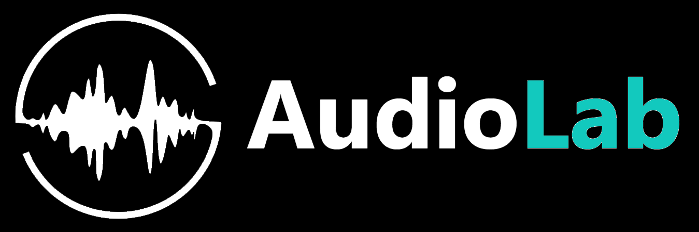
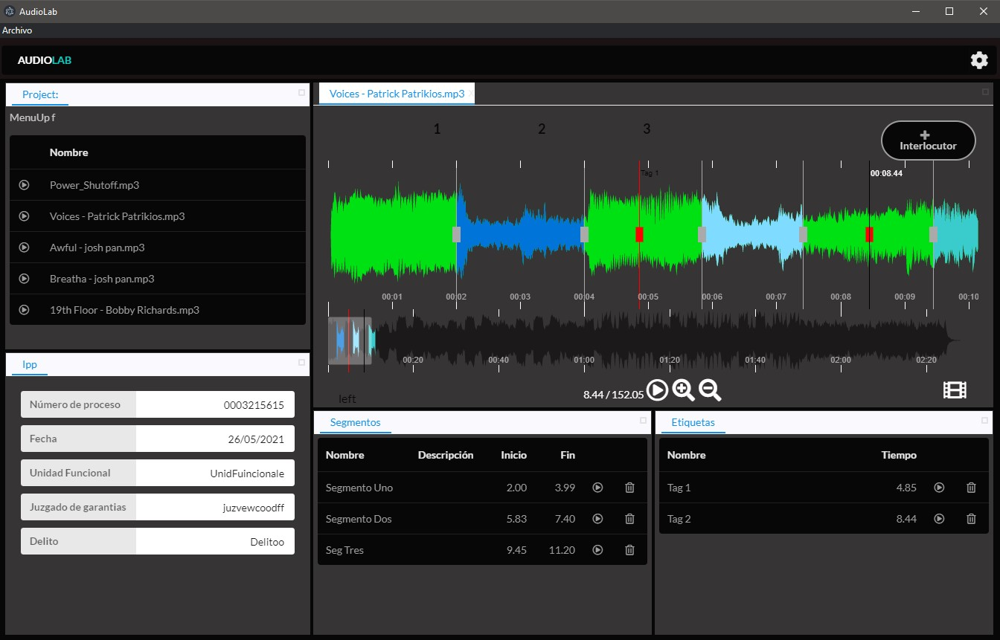

<br />

<p align="center">
    
</p>

# AudioLab

Permite la carga de archivos de distintos medios y distintos formatos.
● La herramienta es portable por lo cual puede ser transportada hacia otros equipos
sin necesidad de instalación.
● No depende de la conectividad a internet.
● Permite ahorrar una considerable cantidad de tiempo al poder etiquetar rápidamente
un audio y establecer relaciones.
● Guarda los resultados en una base de datos.
● Permite generar una presentación para poder ser mostrada en el marco de un
proceso judicial.


- Permite la carga de archivos de distintos medios y distintos formatos.
- La herramienta es portable por lo cual puede ser transportada hacia otros equipos
  sin necesidad de instalación.
- No depende de la conectividad a internet. 
- Permite ahorrar una considerable cantidad de tiempo al poder etiquetar rápidamente
  un audio y establecer relaciones. 
- Guarda los resultados en una base de datos. 
- Permite generar una presentación para poder ser mostrada en el marco de un
  proceso judicial.

  
## Download

You can download the latest version of app from the [web site](https://audilab.net.ar).

## Preview

<p align="center">
    
</p>

## Links

-   [Website](https://www.audiolab.net.ar/)
-   [GitHub](https://github.com/zyrouge/yukino-app)

## Technology

- [Node.js](https://nodejs.org) (JavaScript Runtime)
- [Yarn](https://yarnpkg.com/) (Package manager)
- [React](https://reactjs.org/) (Framework)
- [React-Semantic](https://react.semantic-ui.com/) (UI Style)
- [Peaks](https://waveform.prototyping.bbc.co.uk/) (Library)
- [Electron](https://electronjs.org) (Desktop app)
- [RS-Dock](https://ticlo.github.io/rc-dock/) (Window style)
- [ExpressJS](https://expressjs.com/) (Framework)
- [SQLite](https://www.sqlite.org/index.html) (Database)
- [Sequelize](https://sequelize.org/) (ORM)

## Code structure

- [./src](./src) - Core vue app (SPA)
  - [./ui](./src/ui) - User Interface
  - [./server](./src/server) - Backend
- [./audio](./audio) - Audios Files
- [./images](./images) - Interlocutors Images
- [./resources](./resources) - Required assets

## Contributing

Ways to contribute to this project:

-   Submitting bugs and feature requests in [issues](https://github.com/ChamHerz/audiolab).
-   Opening [pull requests](https://github.com/ChamHerz/audiolab/pulls) containing bug fixes, new features, etc.

## Developer guide

### Cloning & Installing

```bash
git clone git@github.com:ChamHerz/audiolab.git
cd audiolab
yarn
```

### Running the app in development

```bash
yarn dev-react-start
```

### Building the app in development

```bash
yarn preelectro-pack
yarn electron-pack
```

## License

[MIT](./LICENSE)